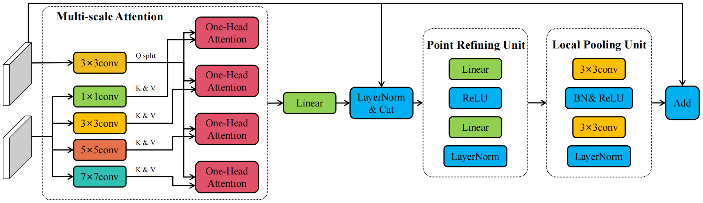

# LGFCTR
Code for "LGFCTR: Local and Global Feature Convolutional Transformer for Image Matching"




## Data preparation
### MegaDepth dataset
Since the preprocessed undistorted MegaDepth dataset provided in [D2-Net](https://github.com/mihaidusmanu/d2-net#downloading-and-preprocessing-the-megadepth-dataset) has been not available, we use the [original MegaDepth dataset](https://www.cs.cornell.edu/projects/megadepth/)

### MegaDepth indices
Download and unzip MegaDepth indices following [LoFTR](https://github.com/zju3dv/LoFTR/blob/master/docs/TRAINING.md#download-the-dataset-indices)

### Build dataset symlinks
Symlink the datasets and indices to the `data` directory following [LoFTR](https://github.com/zju3dv/LoFTR/blob/master/docs/TRAINING.md#build-the-dataset-symlinks)

### Pretrained model
The model weights will be available soon.

## Requirements
### Following LoFTR
Please follow [LoFTR](https://github.com/zju3dv/LoFTR/blob/master/README.md#installation) to prepare the environment.

### Pip by yourselves
In addition, you can also install the requirements by yourselves. More specifically, we use pytorch==1.9.1+cu111, pytorch-lightning==1.3.5, opencv-python==4.5.5.64, torchmetrics==0.6.0 and kornia==0.6.11. Other requirements can be installed easily by pip.

### Pip with our enviornment.yaml
```shell
conda env create -f environment.yaml
conda activate lgfctr
```

## Reproduce
### Training
You can reproduce the training by
```shell
sh scripts/reproduce_train/outdoor_ds.sh
```

### Evaluation
You can reproduce the evaluation on MegaDepth dataset by
```shell
sh scripts/reproduce_test/outdoor_ds.sh
```

## Demos
### Visualize a single pair of images
We provide a demo for visualizing a single pair of images. You can specify `img_path0` and `img_path1` for your images, `save_dir` for your save directory, `topk` for the number of matches shown, `img_resize` for resized longer dimension, and `is_original` for outputing the original images.
```shell
cd vis
python vis_single_pair.py --img_path0 your_img_path0 --img_path1 your_img_path1 --save_dir your_save_dir --topk 1000 --img_resize 640 --is_original True
```


### Visualize multi-scale attention weights
We provide a demo for visualizing multi-scale attention weights of a single pair of images. Besides arguments mentioned above, you can specify `dpi` for the dpi of outputs, and change the Line 41 to specify which index of resolutions and CTR for visualizations.
```shell
python vis_attention.py
```


## Acknowledgements
This repository was developed from [LoFTR](https://github.com/zju3dv/LoFTR), and we are grateful for their implementations.

## Citation
If you find this code useful for your research, please use the following BibTeX entry.
